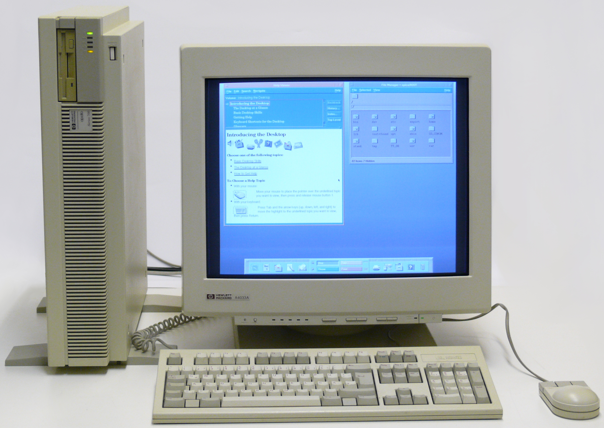

Third, create a technical essay (approximately 3-4 paragraphs) that discusses your interests in software engineering and what kinds of skills and experiences you hope to develop in future.

(The average hand length for women is 6.8 inches, and my hands are 7 inches long, so technically, I have hands a bit larger than average, but I committed to the title of this essay already.) 

## Flash Back
Growing up, my family had one of those bulky off-white computers that were a solid cubic foot and had the extremely loud keyboards. Whenever my dad wasn't using it for work, I would scramble up onto the seat and use it for myself. I usually spent my computer time just playing flash games from [Nick Jr](http://www.nickjr.com/),  or [PBS Kids](https://pbskids.org/). I fancied myself quite tech-savvy for being able to navigate to get to play the dress-up game that I was obssessed with. 

Of course, as I got older, I realized that I really didn't know anything about computers at all. While I never took an actual computer science class until high school, I took the learning into my own hands. Mostly, this just meant I did the HTML and JavaScript courses that were available at [Khan Academy](https://www.khanacademy.org/). I was always interested in trying to make games like the ones I played as a kid, and the possibilities for the websites I could make intrigued me as well.

## Languages My Mouth Can't Speak
After learning your first programming language, it's a lot easier to learn another. Right now, I totally agree with that, as right now, I've learned JavaScript, Java, and C++. But if I was told that when I was struggling 

## Teamwork Makes the Dream Work
I hope to better develop my skills in working in a team for a project. While I have worked in groups in the past, it was never on a coding or software engineering project. A lot of the software projects I've completed were done on my own. 

- skills want to develop:
  - more languages
  - more modes of creating things (apps, websites, etc.) 
- experiences want to develop:
  - working in a team on a project: a lot of the projects i worked on was just on my own
  - 
