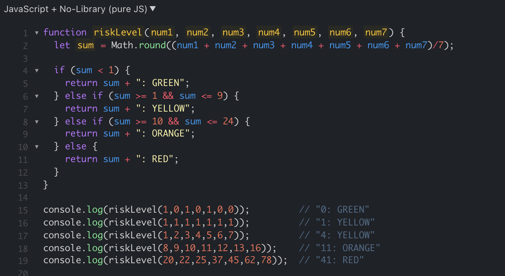

## The Good Old Days
In high school, I took an Intro to Computer Science class, where JavaScript was our main focus. That was my first dedicated computer science class, so I was worried that I would struggle to keep up. However, I found that it was relatively easy to pick up. It wasn't effortless by any means and I had to still put in a lot of work, but compared to what I now know from Java and C++, I find JavaScript to be the most logical language for me. From a software engineering perspective, JavaScript is a great programming language for beginners. It has a shallow learning curve, but still holds a lot of depth so experts could do a ton with the language. 

## The New and Intimidating 
Coming into ICS 314 with a bit of knowledge on JavaScript meant that I wasn't as nervous as I would have been otherwise. I went through the JavaScript course briskly, refreshing my memory on JavaScript syntax and how the language worked. However, I was very surprised about some of the things I learned that were available in ES6. The different syntax and the sheer amount of all of the things you can do with JavaScript left me reeling. 

While the Basic JavaScript course on freeCodeCamp was more of a review for me, I've never even seen any of the things covered in the ES6 course. I initially felt a bit intimidated when faced with how much I still have to learn. However, I quickly realized that my lack of knowledge just means that there's so many new things I can learn how to do and make. I'm excited to create and learn, even if it may take me a little while to pick up all of it. 

## Practice, Practice, Practice! ...And Then Practice, Practice, Practice Some More

Of course, I found that the best way for me to learn is to practice doing it. Luckily, in ICS 314, there are practices built into the class. Workout Of the Days (WODs) are timed coding tasks meant to analyze our progress in learning JavaScript. The timed nature of a WOD make them inherently nerve-wracking, but as I kept doing the practice WODs, I found my initial nerves melting away. 

I try to do multiple attempts for each practice WOD, even if I completed them on time on my first attempt. After a second or third attempt, I am able to complete the WOD quicker and with more efficient code. I can the logic behind the solution and apply it to other problems going forward. Because I want to keep learning, I have to keep up the practice!
