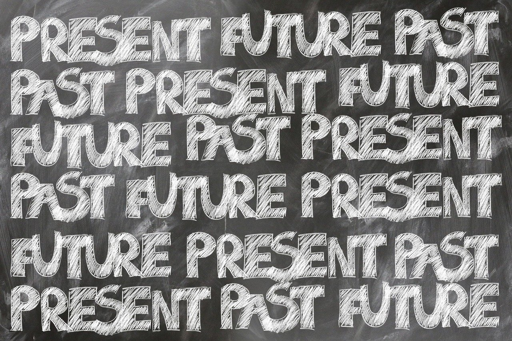

## The Good Old Days

In high school, I took an Intro to Computer Science class, where JavaScript was our main focus. That was my first dedicated computer science class, so I was worried that I would struggle to keep up. However, I found that it was easy to pick up. Compared to what I now know from Java and C++, I find JavaScript to be the most logical for me. From a software engineering perspective, JavaScript is a good programming language. It's especially good for beginners. It has a shallow learning curve, but still has a lot of depth so that you are able to do a lot with the language. 

## The New and Intimidating 
Coming into ICS 314, with at least a little bit of knowledge on JavaScript, I wasn’t as nervous as I would have been otherwise. I went through the JavaScript course briskly, refreshing my memory on JavaScript syntax and how the language worked. However, I was very surprised about some of the things I learned that were available in ES6. The many different functions and the sheer amount of all of the things you can do with JavaScript left me reeling. While the Basic JavaScript course on freeCodeCamp was more of a review for me, I've never even seen any of the things covered in the ES6 course. I initially felt a little bit intimidated when faced with how much I still have to learn. However, I quickly realized that my lack of knowledge just means that there's so many new things I can learn how to do and make. I'm excited to create and learn, even if it may take me a little while to pick up all of it. 

## Practice, Practice, Practice! ...And Then Practice, Practice, Practice Some More
Of course, the only way to learn is to do, and that means practicing. The timed nature of WODs make them inherently nerve-wracking, but as I kept practicing them, I found my intiial nerves melting away. I try to do multiple attempts for each practice WOD, even if I do complete them on time on my first attempt. After a second or third attempt, I am able to complete the WOD quicker and with more efficient code. I can remember the solutions much better and apply the logic to other problems going forward. Because I want to keep learning, I have to keep up the practice!
