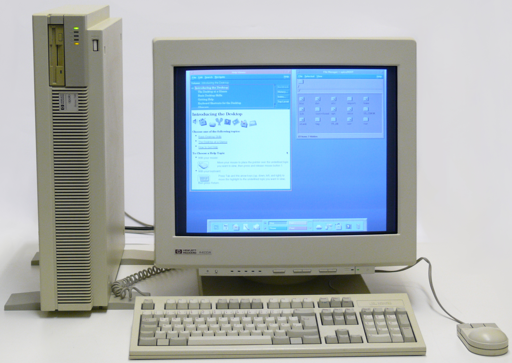

## 

Web application development was always something I was interested in. Whenever someone asked me what I planned to do after I graduated, I always answered with working in software development or website creation. ICS 314: Introduction to Software Engineering seemed to be the perfect match for my interests.

Open source software had seemed strange to me at first. I was of the mindset that having code on the Internet like that meant people would just come to steal it and profit off of it. It seemed like a 

Github seemed so intimidating at first. There was a lot of new vocabulary to learn and it was my first experience with any sort of collaborative code-sharing site. At first, I was very afraid that I would somehow mess up and overwrite my code or delete it somehow. 

- Open Source Software Development
  - Github was so intimidating but it became very easy to use and very useful 

- Ethics in Software Engineering

Our last day of class saw us debating a technology-related moral question. We were assigned to various readings about the ethical responsibilities that creators in tech hold, such as following the [ACM Code of Ethics](https://www.acm.org/code-of-ethics) as well as a variety of case studies, such as [Gamergate](https://en.wikipedia.org/wiki/Gamergate_(harassment_campaign)). Our groups were randomly assigned which side we were to argue for and given 20 minutes to prepare.

The ethical debate goes as follows:
```
Now, assume that you work at WatchMe Inc as a software engineer. You have just been assigned to work on the GetFace system, which is a facial recognition system that WatchMe is marketing to law enforcement agencies across the country. You have discovered that the project does not observe several of the guidelines proposed by the ACLU to ensure ethical use of the technology. Specifically: 
 - Informed consent was not obtained from the individuals whose faces are being used to train the system. 
 - Citizens do not have the ability to access, edit, or delete their information.
 - There are no dedicated security professionals for maintaining the security and privacy of the information.
 - The results of the facial recognition algorithm are sold without informed, written consent
```
This, accompanied with a couple of links to resources on all of the ethical problems with facial recognition software made it seem as if the odds were incredibly stacked against us. 

  Of the two resources given to us, the odds seemed incredibly stacked against 
      - arguing a point that i didnt agree with at first actually made me open my mind to other points of views and realize
      - that things arent so black and white . esp with technology, a lot of this is so new that we are in the process of 
      - figuring out what is good and bad. 