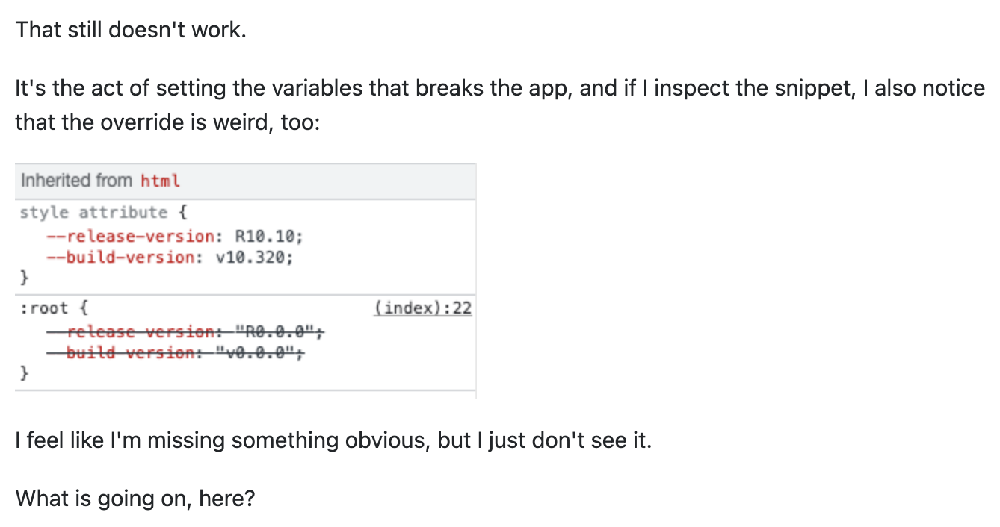

## The Right Questions
Asking questions is important. When we're learning something new, having questions about the material is a good sign that you're paying attention and thinking critically about the subject. I used to be afraid of asking questions. I held my mouth shut, not wanting to seem dumb or annoying. However, I learned the hard way that avoiding asking questions only hurts you in the end. 

If you're like how I was, it's important to learn how to ask questions, and more importantly, how to ask *smart* questions. Asking smart questions doesn't make you look dumb, it makes you look inquisitive and willing to learn more. With the Internet, troubleshooting is easier than ever. The answers to most of our questions are at our fingertips. But just because we're not face-to-face, it's still important to ask questions in a way that respects the time of everyone involved. 

The most important thing to know about asking smart questions is to know that it's okay to be ignorant, but it's not okay to be rude. Often, people who help answer your questions are doing so for free in their own spare time, so being entitled is not a flattering look and will not get you an answer any faster. 

## Good Lessons From Bad Examples
To learn how to compose a smart question, it's can help to see how to ask a *not so smart* question. Ren'Py is a visual novel making engine that is built off of the programming language Python. While Ren'Py has its own programming logic, users can use Python to add anything else they want to add to their game. 

In [this post](https://stackoverflow.com/questions/69848012/my-renpy-code-just-fails-at-working-labels-are-broken-menus-are-broken-all-thing), this user's header is "My renpy code just fails at working labels are broken menus are broken all things are just dead," which is already a red-flag. In the header of posts, you should include only meaningful, specific information that applies to your question. It's the first thing that anyone sees about your post, so it's the best way to grab someone who can help you's attention and alert them to what your issue is. In this header, the issue at hand isn't clear at all. In addition to that, having improper grammar doesn't give a great first impression. 

Within the post itself, the poor grammar continues and that can make the issue harder to parse. It begins with unneccessary information with, "My renpy code just dies." After that, all the information that is given is one run-on sentence and a short snippet of code that "completely broke the game." The user doesn't provide the error message that Ren'Py supplies. Without enough information to know for sure what is wrong, people are left to guess at a solution. Answering this question will require a lot of clarification and back-and-forth. And indeed, the first response on the post is someone giving a guess for what they think could fix their issue, but notes that the original poster really should have included the error message so that they could provide an actual answer. 

## Good Lessons From Good Examples

It's important to learn from seeing good examples as well. Smart questions clearly describe the symptoms of your problem, descibe the research you did to try solve this problem before you asked, and provide the steps necessary to reproduce the problem. 

In [this post](https://stackoverflow.com/questions/70862723/why-does-changing-css-variables-in-js-break-the-app), the user's header is, "Why does changing CSS variables in JS break the app?" While it's not extremely descriptive, it does provide enough information to know that the question is about CSS variables and how they interact in JavaScript.

Within the post, the user provides a link to a site that outlines what they were basing off their initial code off of and describing how they wanted to try alter it in their program. This is great, as responders can easily track what the user's starting point was and the ways they altered it. After that, the user described their multiple attempts at fixing the issue, along with the specific code snippets of their attempts. This makes it really easy for any responders to follow along with the poster's thought process and provide guidance on any missteps. 

At the end of the post, they ask for an explanation as to why their code isn't working as they think it should. Asking smart questions like this allows responders to answer back quickly with a clear and concise answer. The answer to this post is a clear explanation as to why this poster's code didn't work, as well as a possible solution. 

## Lessons Learned
Asking smart questions guarantees an answer quicker and makes the whole experience less annoying for everyone involved. Askers get their questions answered more quickly and effectively, and responders don't feel as frustrated when helping others out. Asking questions in a not-so-smart way will lower the likelihood that someone will actually put in the time to answer your question. Knowing how to ask questions in a way that will get me my questions answered and won't bother others reassures me. From now on, I'll shoot down that fear and go troubleshoot! 
