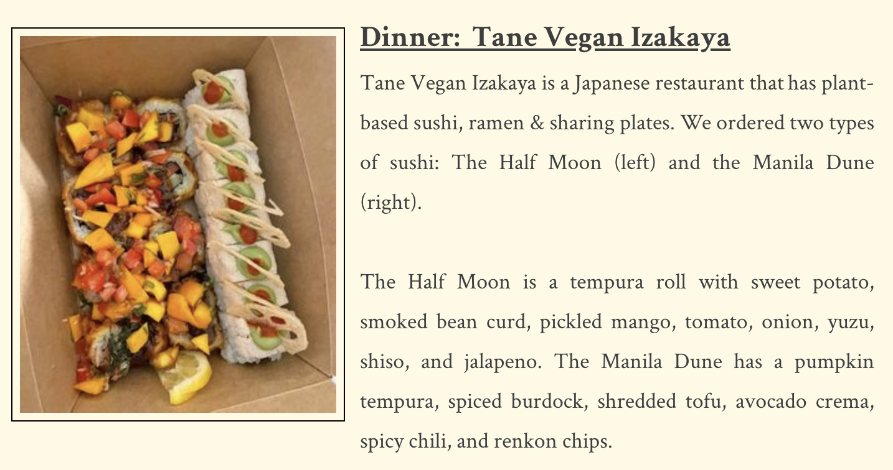

I developed a blog focused on food for my ENG 313 class. Blog posts often required us to visit different restaurants that we've never been to before and writing about our experience there. As I previously only wrote fiction, writing creative nonfiction was a new experience for me. 

On the About Me page of my website, I learned how to add subscripts with HTML. While writing posts, I learned how to take and edit flattering photos of food, and how to better incorporate 

The blog can be found [here](https://carrotcarolcake.weebly.com/).

