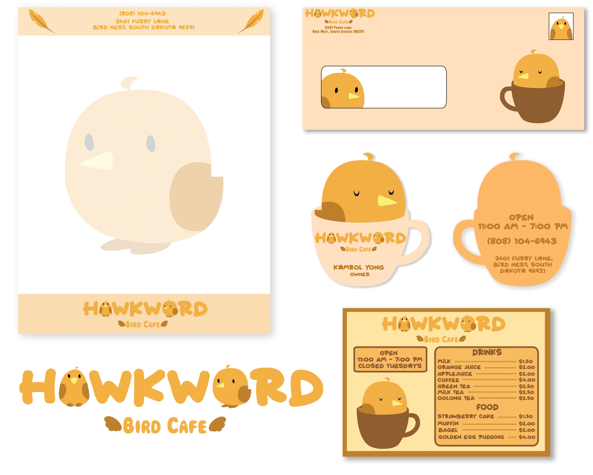

Our final project for my high school senior year graphic design class was to create something that would be entered into the [Pele Awards](https://www.peleawards.com/). 

I decided to enter the Advertising division, and create the stationary for a business. I made up a bird cafe named "Hawkward Bird Cafe". A bird cafe would have be similar in concept to a cat cafe, except with birds instead of cats. Through this experience, I learned how to make a cohesive theme that one's brand can build around. Sticking to a warmer yellow and brown color scheme, I imagined this cafe to have a rustic and cute vibe, aiming to appeal to a younger demographic who may be allergic to other pets. The bird designs and the main font I used was round and cute to fit this theme.

With this project, I also bettered my skills at Adobe Photoshop and Illustrator. I got comfortable using the pen tool and clipping masks to create my design. An important skill I developed was learning to balance creativity and convenience. I had a lot of creative liberties with this project, so I designed nonconventionally shaped business cards. However, I ensured that they would still fit inside of a wallet, as that is where most people keep business cards. In addition, I had to make sure that the text used was large and contrasted enough with the background to ensure it was still readable.

Hawkward Bird Cafe placed Silver in the Specialty Advertising (Other) division. 
