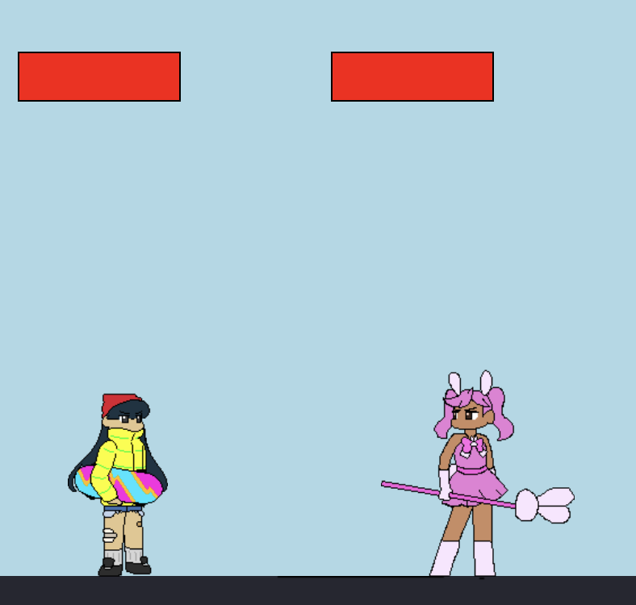

sentence.Live is a two-player fighting game developed in my junior year Intro to Computer Science course in high school.

The two players share one keyboard for input, with one player using WASD to move and V and B to attack, while the other player uses the arrow keys to move and L and K to attack. 

For this project, I developed the programming and the art. A lot of the art that is used was placeholder art that I intended to replace. However, I couldn't 

The game can be played and the code can be viewed [here](https://studio.code.org/projects/gamelab/7Ns_XQvP99pPVCVWe3YGuzr6EyS6dDP3NgYoeRpcsdQ). 

