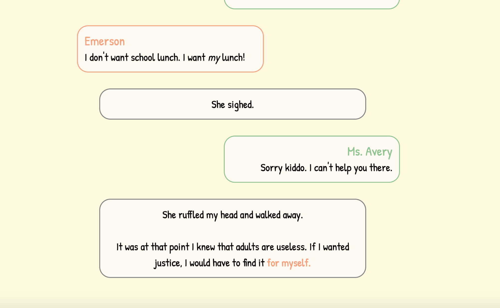

Flash Mobs and Stolen Lunches is an interactive fiction game that I created for the I Can't Write but Want to Tell a Story Game Jam (Link is now defunct) and the [Summer Novel Game Jam](https://itch.io/jam/sunofes20). 

The I Can't Write game jam took place over the course of one month. During that time, I learned how to use [Twine](https://twinery.org/), which is an open-source tool used to make interactive fiction projects using webpages. Through the functions and macros that are built in Twine, I was able to create a detective game that relied on talking to characters and presenting clues that were gathered throughout the story. In addition, I wrote the story, created the art, and managed the CSS for the game. 

This was the first time I've entered a game jam, and the first time I created and maintained deadlines for a personal project. While I dabbled in CSS in high school, I had to grasp a much better understanding of it to be able to customize my game fully.  

The game can be played [here](https://hullabaloo.itch.io/flash-mobs-and-stolen-lunches).

Source: <a href="https://github.com/theVacay/vacay"><i class="large github icon"></i>theVacay/vacay</a>
