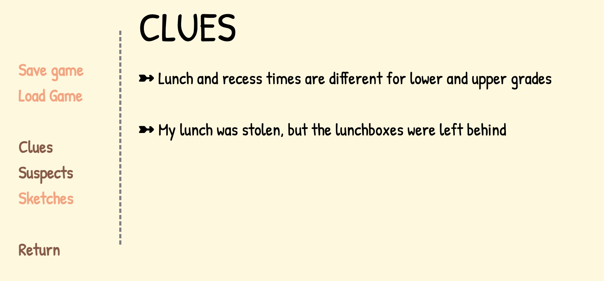

Flash Mobs and Stolen Lunches is an interactive fiction game that I created for the I Can't Write but Want to Tell a Story Game Jam (Link is now defunct) and the [Summer Novel Game Jam](https://itch.io/jam/sunofes20). Both of these game jams emphasized games that had a focus on its story and plot. 

The I Can't Write game jam had an earlier deadline and took place over the course of one month. During that time, I learned how to use [Twine](https://twinery.org/), which is an open-source tool used to make interactive fiction projects with HTML. Through the functions and macros that are built in Twine, I was able to create a detective game that relied on talking to characters and presenting clues that were gathered throughout the story. 

This was the first time I've entered a game jam, and the first time I created and maintained deadlines for a personal project. Because I only had one month to learn a new software, write the story, and draw all of the art, I had to manage my time wisely and set goals for myself. I learned to set a cushion around my deadlines to ensure that I would get everything done in a timely manner. While I dabbled in CSS in high school, I had to gain a much better understanding of it to be able to customize my game fully.

The game can be played [here](https://hullabaloo.itch.io/flash-mobs-and-stolen-lunches).

